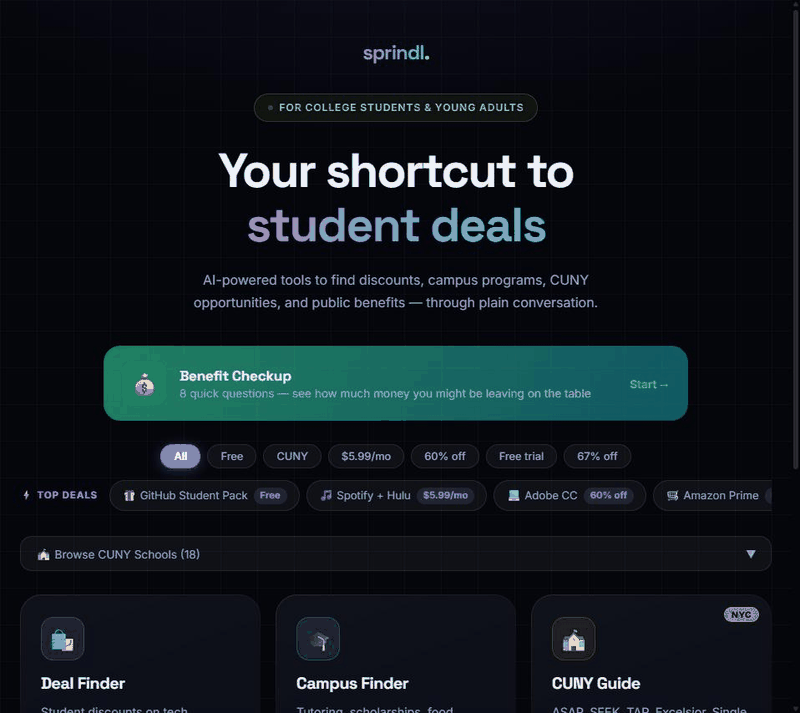

<div align="center">

# Sprindl

**Your shortcut to student deals, scholarships, public benefits & campus programs.**

[](https://github.com/HussamAhmad4/sprindl/actions/workflows/ci.yml)
[](https://github.com/HussamAhmad4/sprindl/actions/workflows/link-check.yml)
[](LICENSE)

**[▶ Live demo](https://hussamahmad4.github.io/sprindl/)** · Built with React 19, Vite, and the Claude API



</div>

---

## What it does

**💰 Benefit Checkup** — answer 8 questions, get an estimated dollar amount of benefits you may be missing (Pell, TAP, Excelsior, SNAP, Fair Fares, and more), each with an official link. Share your results with one tap.

Plus five AI-powered chat tools:

| Tool | What it finds |
|------|--------------|
| 🛍️ **Deal Finder** | Student discounts at Best Buy, Apple, Adobe, Spotify, GitHub, Amazon, and more — filterable by category |
| 🎓 **Campus Finder** | Tutoring, scholarships, food pantries, career services, and clubs at your specific school |
| 🏫 **CUNY Guide** | ASAP, SEEK, TAP, Excelsior, Single Stop, CUNY Start, Reconnect, and programs across all CUNY campuses |
| 🚀 **Student Opportunities** | Paid internships, research programs (NSF REU, NIH), fellowships, scholarships, AmeriCorps, SYEP |
| 🧭 **Resource Guide** | FAFSA, SNAP, Medicaid, PSLF, mental health lines, legal aid — 40+ real programs |

Ask anything in plain English. The AI returns structured, actionable results with direct links and student pricing. Finish the Benefit Checkup once and every chat tool personalizes its answers to your situation — no re-asking.

## Why it's built this way

Most AI apps let the model decide everything. Sprindl deliberately doesn't:

- **Money is deterministic.** The Benefit Checkup runs on a rules-as-data engine (`src/checkup/rules.js`) with a pure, unit-tested evaluator. The AI never decides eligibility — so dollar estimates are grounded, reproducible, and testable (`npm run test:checkup`).
- **Links are real.** Chat recommendations are anchored to a curated catalog of 40+ verified programs rather than generated, so there are no hallucinated URLs. A scheduled CI job re-verifies every catalog link weekly (`scripts/check-links.mjs`).
- **Conversation is where AI shines.** Claude handles the plain-English understanding — mapping "I can't afford food this week" to SNAP, campus pantries, and 211 — with structured JSON output parsed defensively on the server.
- **Privacy by default.** No accounts. Checkup answers and bookmarks live in `localStorage`; only a short plain-text summary is sent with chat requests to personalize replies.

## How it works

- **Frontend:** React 19 + Vite — component-based chat UI with a custom "aurora glass" design system
- **AI:** Claude API with structured JSON output — raw `fetch`, no SDK
- **Eligibility engine:** rules-as-data + pure evaluator — deterministic dollars, AI only for follow-up questions
- **Backend:** Vercel serverless function (`api/chat.js`) proxies the API key; Express server mirrors it for local dev
- **Rate limiting:** in-memory, 10 requests/min per IP; requests validated for mode and message size
- **CI:** lint + engine tests + build on every push; weekly automated dead-link check on the catalog

## Local setup

```bash
git clone https://github.com/HussamAhmad4/sprindl.git
cd sprindl
npm install

cp .env.example .env
# edit .env and set ANTHROPIC_API_KEY=sk-ant-...

npm run dev:all
# Frontend: http://localhost:5173
# API: http://localhost:8787
```

## Deploy (Vercel)

```bash
npm install -g vercel
vercel
```

Then set `ANTHROPIC_API_KEY` in the Vercel dashboard → Project → Settings → Environment Variables. The chat backend runs as a serverless function, so the API key is never exposed to the browser.

> **Note:** the GitHub Pages workflow deploys the static frontend only — chat requires the Vercel deployment (Pages has no backend for `/api/chat`).

## Project structure

```
├── api/chat.js              # Vercel serverless function (API proxy + rate limiter)
├── server/index.js          # Express dev server (mirrors api/chat.js)
├── scripts/
│   ├── test-eligibility.mjs # Unit tests for the eligibility engine
│   └── check-links.mjs      # Weekly dead-link checker (CI)
├── lib/
│   ├── chatHandler.js       # Claude API caller + JSON output parser (5 modes)
│   ├── systemPrompts.js     # Mode-specific system prompts
│   └── resourcesHelper.js   # Resource ID → object lookup
├── src/
│   ├── data/                # Curated catalog: 40+ verified programs + deals
│   ├── checkup/             # Eligibility engine: rules-as-data + pure evaluator + profile
│   ├── hooks/               # useChat, useBookmarks
│   └── components/          # Chat UI, result cards, filters, bookmarks
└── .github/workflows/       # CI, weekly link check, Pages deploy
```

## Security

The Anthropic API key never reaches the browser: all Claude requests are proxied through the serverless function or Express server, `.env` is gitignored, and the API validates mode and message size before forwarding.

## License

MIT
